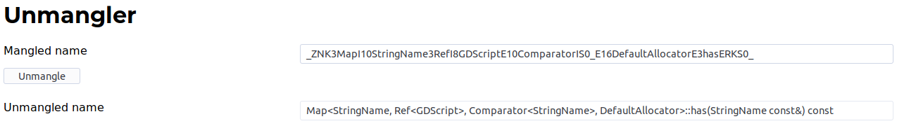

# UnmanglerFrontend
Fronted for the GNU C++ name unmangling tool

This is a web-based tool for demangling names generated by the GNU C++ compiler.

This web-based frontend displays mangled and demangled name while a [REST web service](https://github.com/agentS/UnmanglerBackend) is used for demangling.

